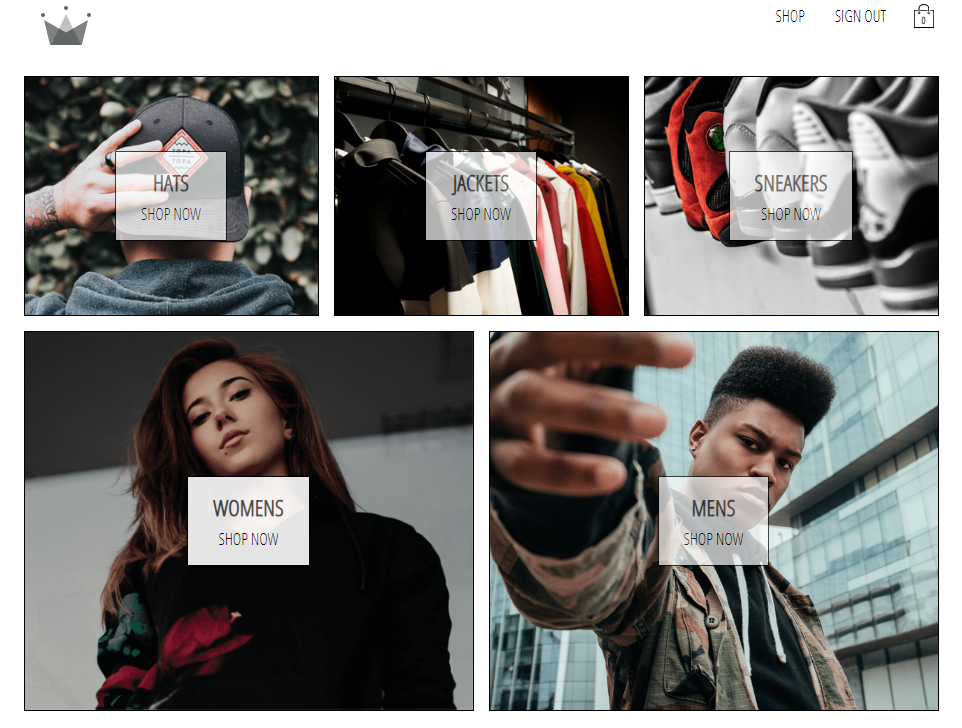

# Crown Clothing E-commerce Application

## Demo link:
Access the live site at [Crown Clothing](https://crwn-live-jw.herokuapp.com/)

## Table of Content:

- [Crown Clothing E-commerce Application](#crown-clothing-e-commerce-application)
  - [Demo link:](#demo-link)
  - [Table of Content:](#table-of-content)
  - [About The App](#about-the-app)
  - [Screenshots](#screenshots)
  - [Technologies](#technologies)
  - [Setup](#setup)
  - [Approach](#approach)
  - [Status](#status)
  - [Credits](#credits)

## About The App
Crown Clothing is an e-commerce platform that offers convenient online buying experience.  

## Screenshots

Home page

## Technologies
- React Basics
- React Router
- Redux
- Redux Saga
- Asynchronous Redux
- React Hooks
- Context API
- React Suspense + React Lazy
- Firebase
- Stripe API
- Styled-Components

## Setup
- download or clone the repository
- run `npm install` in main folder as well as in client folder
- run `npm run dev` in main folder 

## Approach
I followed the react design pattern and best practices.

## Status
Version 1 of the project is finished. 

## Credits
Zero To Mastery
- Yihua Zhang
- Andrei, Neagoie